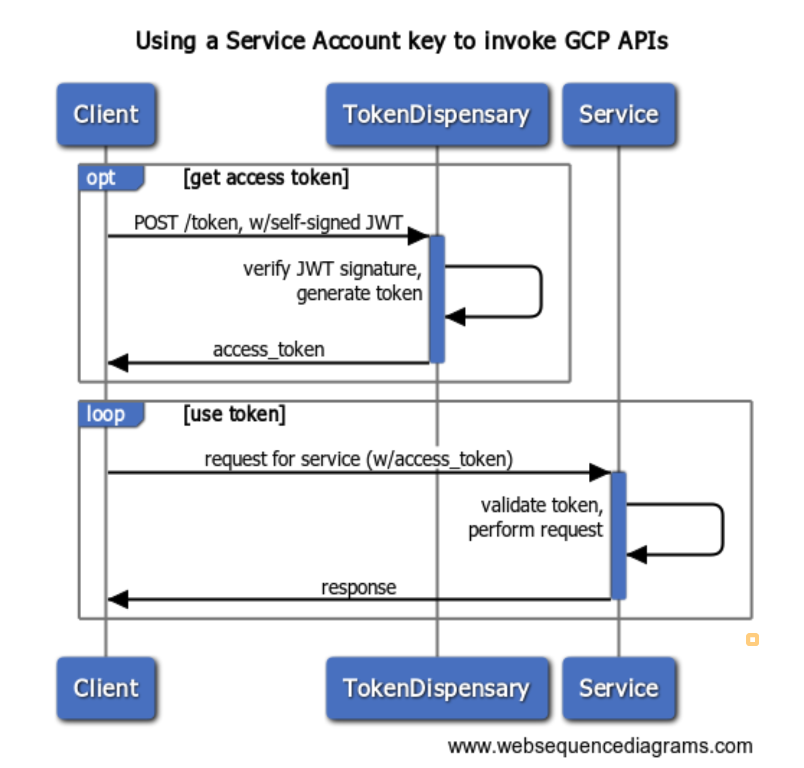
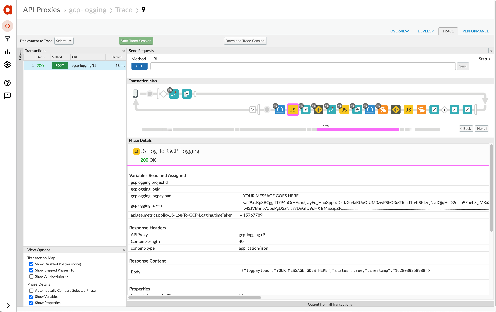

# Google Cloud Logging demo proxy

This repo includes an API Proxy bundle showing how to do logging from
Apigee to Google Cloud Operations Suite (formerly known as "Stackdriver").

## License

This material is Copyright 2017-2021 Google LLC and is licensed under the [Apache 2.0
License](LICENSE). This includes the the API Proxy configuration as well as the
nodejs programs and libraries.

## Disclaimer

This example is not an official Google product, nor is it part of an official Google product.
If you have questions on using it, please ask  via github or community.apigee.com .

## What is Google Cloud Logging?

[Google Cloud's Operations Suite](https://cloud.google.com/products/operations)
is a software-as-a-service for logging, monitoring, and
alerting. It started as an independent company named "Stackdriver" but was acquired by Google in 2014,
and is now part of the Google Cloud Platform. The product has a
full REST API to control it, including an option to allow systems or applications to write log messages into a named log stream. There is an administrative UI for viewing the messages, configuring alerts on
the messages, and so on.

## How does GCP Operations Suite complement Apigee?

Some people embed MessageLogging policies into the API Proxies they have in Apigee
in order to log messages into log aggregators (like a syslog endpoint, or a Splunk collector) that can later be examined or analyzed, to diagnose
problems or simply to monitor their systems. MessageLogging works for syslog
listeners. For example, Splunk has a syslog listener that will accept inbound
messages from a MessageLogging policy configured in Apigee Edge.

But some people want to use the Google Cloud Platform. This example shows how
you can use GCP Cloud Logging to collect and aggregate log messages from Apigee,
using built-in policies.

## How it works

The Logging API supports OAuth 2.0 for inbound API calls to write (or read, or
query) log messages. For our purposes, we want Apigee to only write messages.  The
OAuth token is a standard bearer token, and Google dispenses the token via an RFC7523
grant (see [RFC 7523 - JSON Web Token (JWT) Profile for OAuth 2.0 Client Authentication
and Authorization Grants](https://tools.ietf.org/html/rfc7523)).  This grant is very
much like a client credentials grant as described in [RFC 6749 - OAuth
2.0](https://tools.ietf.org/html/rfc6749), except, rather than sending in a client_id
and client_secret in order to obtain a token, the client must generate and self-sign a
JWT, and send that JWT in the request-for-token.


This image depicts the flow:




There are some requirements on the JWT. It must:

* be signed with RS256 using the private key associated to a service account
* include the "service account email address" as the issuer
* specify the `token_uri` value from the service account JSON file (currently `https://oauth2.googleapis.com/token`) as the audience
* specify "https://www.googleapis.com/auth/logging.write" as the scope claim
* expire within no more than 300 seconds
* be signed with the client's private key.

An example header:

```json
{"alg":"RS256","typ":"JWT"}
```

and payload:

```json
{
  "iss":"service-account-1@project-name-here.iam.gserviceaccount.com",
  "scope":"https://www.googleapis.com/auth/logging.write",
  "aud":"https://oauth2.googleapis.com/token",
  "exp":1328554385,
  "iat":1328550785
}
```

The request for token looks like this:

```
POST https://www.googleapis.com/oauth2/v4/token HTTP/1.1
Content-Type: application/x-www-form-urlencoded

grant_type=urn:ietf:params:oauth:grant-type:jwt-bearer&assertion=JWT_GOES_HERE
```

If the JWT is valid, googleapis.com will return an access token, which will have a
lifetime of 1 hour.  (Though this may be subject to change, I suppose). The response looks
like this:

```json
{
  "access_token" : "1/8xbJqaOZXSUZbHLl5EOtu1pxz3fmmetKx9W8CV4t79M",
  "token_type" : "Bearer",
  "expires_in" : 3600
}
```

You can then use that access token as a bearer token with the Logging APIs. And in fact, the same pattern applies for any of the services within Google Cloud: Pub/Sub, DLP, BigQuery, and so on.

For scalability, a system that logs to Cloud Logging should obtain and cache
the access token, and must be able to obtain new access tokens on expiry.

Once the system has a valid access token, it can invoke the Logging API to write an entry.
That looks like this:

```
POST https://logging.googleapis.com/v2/entries:write
Authorization: Bearer TOKEN_HERE

{
  "logName": "projects/:projectid/logs/:logid",
  "resource" : {
    "type": "api",
    "labels": { }
  },
  "labels": {
      "flavor": "test"
  },
  "entries": [{
      "severity" : "INFO",
      "textPayload" : "Hello I must be going"
     }
  ],
  "partialSuccess": true
}
```

The example here is an API Proxy that performs all of the above.

## What's Included?

There's a single API Proxy bundle that provides the example you should follow:
[gcp-logging](./bundles/gcp-logging). This API proxy
refreshes the access_token for GCP inline with respect to the API
request, relying on builtin Apigee policies like GenerateJWT, ServiceCallout,
LookupCache and PopulateCache.


## A Walkthrough

Here's a walk-and-talk-through of how it works. Click the image to see the screencast:

[](https://youtu.be/OjWraDH65yo "Using Cloud Logging from Apigee")


# Now try it yourself

You can try this yourself.


## First things first: set up the project

1. Visit [the Google Cloud console](https://console.cloud.google.com/),
and select a project, or create a new project.

2. Using [the service accounts
management page](https://console.developers.google.com/iam-admin/serviceaccounts), create a
service account, generate a new private key for the service account, and save the private
key to a JSON file.  All of this is shown in the screencast.


## Create the Apigee KVM

To support the management of GCP access tokens, you need to have a named
key-value map on the Apigee side, called `secrets1`; It must be encrypted and
environment-scoped.

The `secrets1` KVM stores the private key of the client (the service account),
which is used to sign the JWT required to get each new access token.
The settings1 KVM stores other
operations- and GCP-related settings, like the project ID and so on.

The proxy also uses the Apigee cache
to store the access token for its lifetime.


The API Proxy within Apigee uses a key-value map, named `secrets1`.  To set up
the pre-requisite KVM, there is a [createKvm.js](./tools/createKvm.js) script in
the tools directory. For this you need to specify the name of Apigee
organization and environment.

Before you run this script, you must install the required node libraries. (You
must have nodejs and npm installed to do this).

```
cd tools
npm install
```

Then, run this from the tools directory:
```
ORG=myorg
ENV=test
node ./createKvm.js -u username@example.com -o $ORG -e $ENV
```

Replace `username@example.com` with your Apigee signin. You will have to provide
a password. You may need to provide a passcode; do so with the `-C` option.

You should see a happy message.


## Load the Service Account key into the Apigee KVM

For this you must import and deploy the kvm-maintenance API proxy.

Run this from the tools directory:
```
ORG=myorg
ENV=test
node ./importAndDeploy.js -u username@example.com -o $ORG -e $ENV ../bundles/kvm-maintenance
```

You should see that the `kvm-maintenance` API proxy is deployed.

## Invoke the kvm-maintenance proxy to Load the SA Key

```
# For Apigee Edge
endpoint=https://$ORG-$ENV.apigee.net
# For Apigee X or hybrid or OPDK
endpoint=https://your-custom-endpoint.net

curl -i -X POST $endpoint/kvm-maintenance/kvpair -d key=sakeyjson --data-urlencode value@/path-to/my-sacreds.json
```

The path should point to the JSON file containing the service-account key that
you downloaded from Gooogle Cloud console

The JSON file contains information such as:

* GCP Cloud Logging project id
* the PEM-encoded private key you got from GCP Cloud Logging
* the issuer, or email of the service account you got from Operations


This command loads the JSON file in its entirety into the encrypted KVM.

## Import and Deploy the Proxy

After creating the KVM and loading it, you then need to import and deploy the
proxy that performs the logging.

To do so, run this from the tools directory:
```
node ./importAndDeploy.js -u username@example.com -o $ORG -e $ENV ../bundles/gcp-logging
```

Again, you should see a happy message.


## Invoke the Proxy

After you've provisioned the KVM and cache, and then imported and deployed the proxy, you should be able to invoke it.  Here's a sample call invoking the API proxy that does "inline" token refreshing:

```
curl -i https://$ORG-$ENV.apigee.net/gcp-logging/t1 \
  -H content-type:application/json \
  -d '{ "payload" : "YOUR MESSAGE GOES HERE" }'
```
This invokes Operations Suite Logging via the httpClient from within a JavaScript callout. The httpClient does not wait for a response. This means a minimum of delay introduced into the proxy flow.

To invoke the API that logs to Operations and waits for a response, we can use ServiceCallout. Like this:

```
curl -i https://$ORG-$ENV.apigee.net/gcp-logging/t1 \
  -H content-type:application/json \
  -H useSC:true \
  -d '{ "payload" : "This Message was Delivered via ServiceCallout" }'
```


## View the logs in GCP Operations Suite

Then, open [the Cloud Logging logviewer webapp](https://console.cloud.google.com/logs/query) to view the log messages.

## This is a Pattern

Most Google Cloud services, including BigQuery, PubSub, DLP, and many more, are
available via the same OAuth 2.0 pattern. If you have a service account, you can
use the same basic API Proxy to obtain a token for other services. You need only
to request the proper scopes, in the JWT. And of course you need to assign the
proper toles to the service account, to allow it to request tokens with those
scopes.
