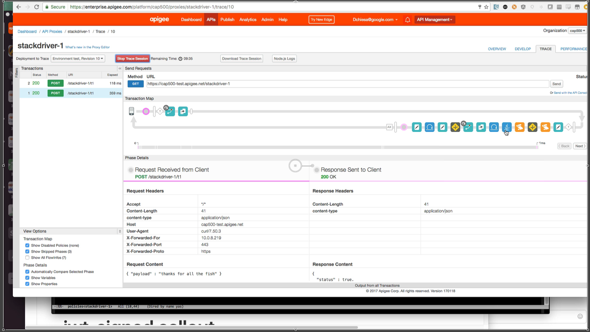
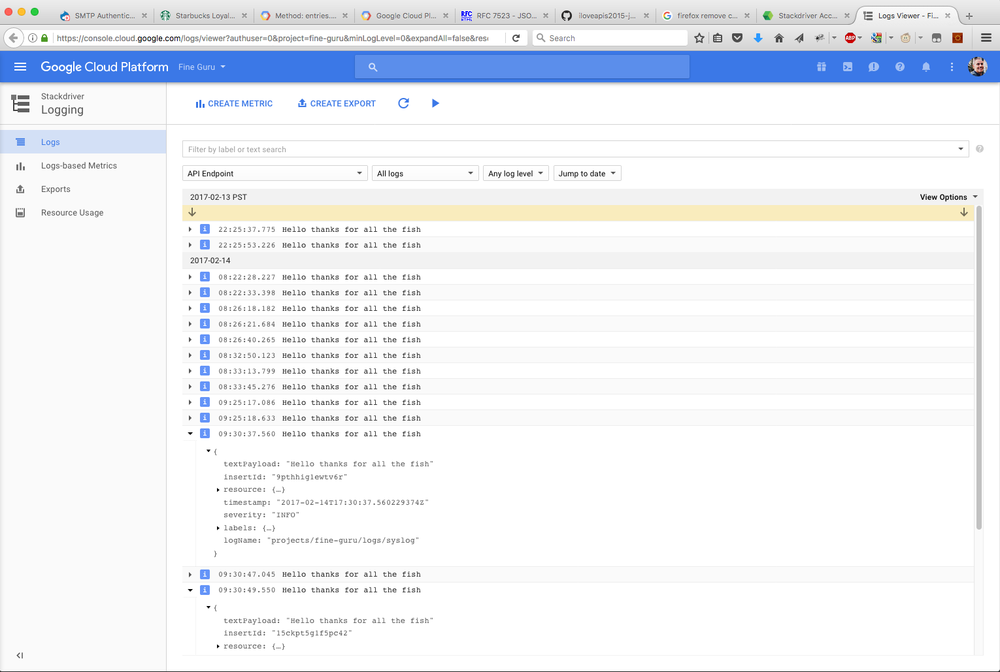

# Stackdriver demo proxy

Monday, 13 February 2017, 17:54

This API Proxy shows how to do logging from Edge to Stackdriver using
built-in policies, plus the JWT generator. 

There are multiple things required:

 - encrypted KVM called "secrets1"
 - regular KVM called "settings1"
 - cache called cache1

all environment-scoped.


## A Screencast

Here's a talk-through of how it works. Click the image to see the screencast:

[](http://www.youtube.com/watch?v=ozxELv8Z2G0 "Using Stackdriver from Edge")


## How to use: First things first

Get your service account set up with the Google API console.
You need a private key, and a client_id or email account for the service account.
Save the private key to a file. 
You also need a project  id and a log id. These are stackdriver things.


## Setting up the KVMs and Cache

To set up these pre-requisites, there is a provisionKvmAndCache.js script in the
tools directory.  For this you need to specify things that are specific to your situation, like:

* name of Edge organization and environment
* Stackdriver "projectid" and "logid"
* the file that contains the PEM-encoded private key you got from stackdriver
* the issuer, or email of the service account you got from stackdriver

Example:
```
cd tools
node ./provisionKvmAndCache.js -n -o cap500 -e test \
    -P fine-guru -L syslog  \
    -k ~/dev/stackdriver/fine-guru.privatekey \
    -I service-account-1@fine-guru.iam.gserviceaccount.com

```

## Importing and Deploying the Proxy

You also need to import and deploy the proxy.  To do so, follow the
example. Again, specify the Edge organization and environment.

```
cd tools
node ./importAndDeployProxy.js -n -d .. -N stackdriver-1 -o cap500 -e test
```

Everything should succeed. If not, then you don't have a CPS-enabled
org, or the cache or KVMs were not properly configured.


## Invoking the Proxy


```
curl -i https://cap500-test.apigee.net/stackdriver-1/t1 \
  -H content-type:application/json \
  -d '{ "payload" : "YOUR MESSAGE GOES HERE" }'

```

## View the logs in Stackdriver

Then, open the Stackdriver webapp and view the log messages:


